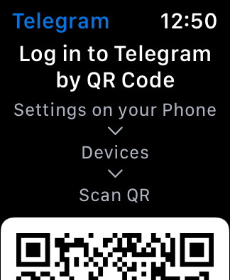
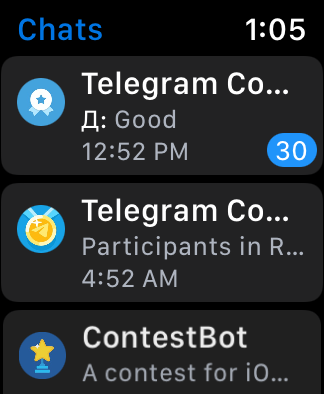
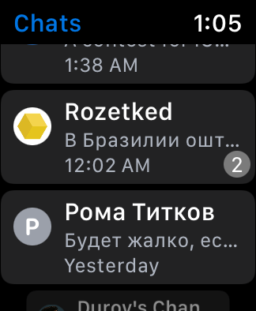

# Telegram watchOS

## Overview

This repository contains the Swift implementation of the standalone Telegram app for watchOS 6, which depends on the [TDLib](https://github.com/tdlib/td) library.

### Supported Features

- [x] Logging in via QR Code with support for accounts protected by a 2-Step Verfication password
- [x] Viewing the chat list

### Screenshots

 

 

## Build Instructions

1. Open the `Config.xcconfig` file and fill in your own `api_id` and `api_hash` (can be obtained at https://my.telegram.org)

2. Open `Telegram.xcodeproj` in the latest Xcode and select the `Telegram WatchKit App` scheme, then run (⌘R)

> Please note that building the app for ARM64 watchOS Simulator (for Mac computers with Apple Silicon) is not supported.
